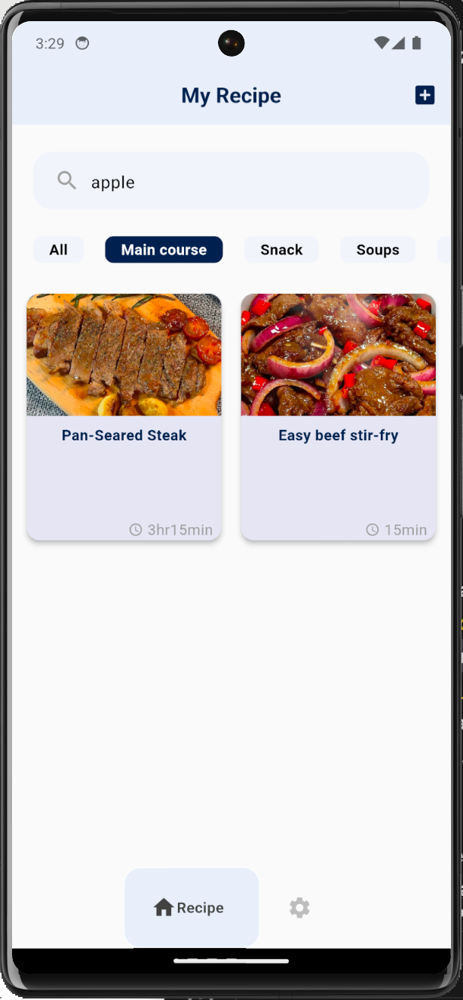
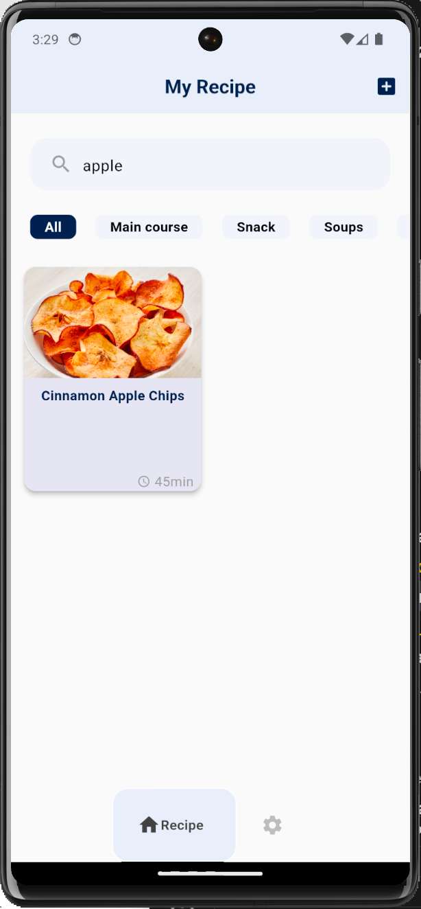

# My Recipe

"My Recipe" is a mobile application designed for cooking enthusiasts who cherish the art of crafting and sharing delicious meals. It serves as a personal digital cookbook that allows users to create, store, and manage their own recipes with ease. At its core, "My Recipe" simplifies the cooking process by organizing recipes into a streamlined, user-friendly interface.

With the ability to upload photos directly using the smartphone's camera, users can visually document their culinary creations, making it easier to follow along or share visual tips with others. The app supports search functionality, enabling users to quickly find recipes by title or ingredients, turning a scattered collection of dishes into an easily navigable repository.

## Landing Page
[https://myrecipemange.framer.website/]

## Screen Shots and Core Features

### Sign In, Sign Up, Reset Password

  
  
  

### Recipe Add & Detail Page

  
  

### Recipe Categorization

  

### Search Recipe

  

